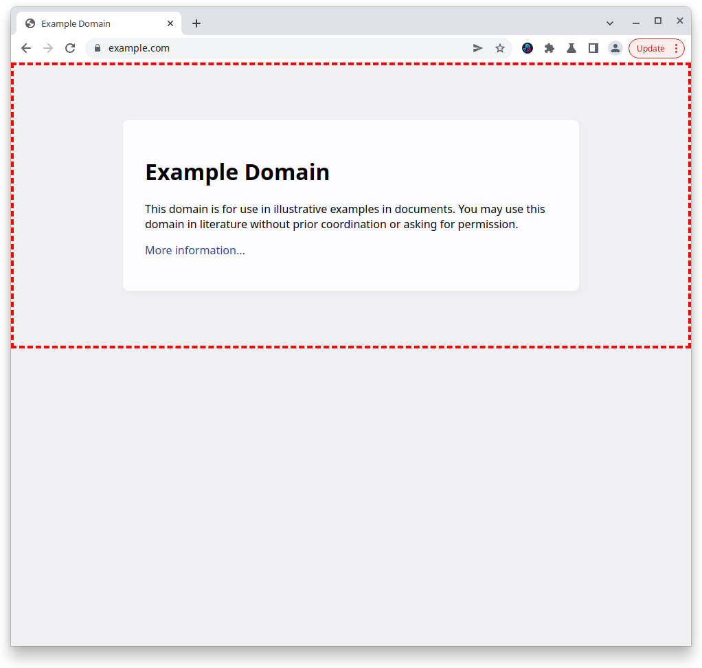
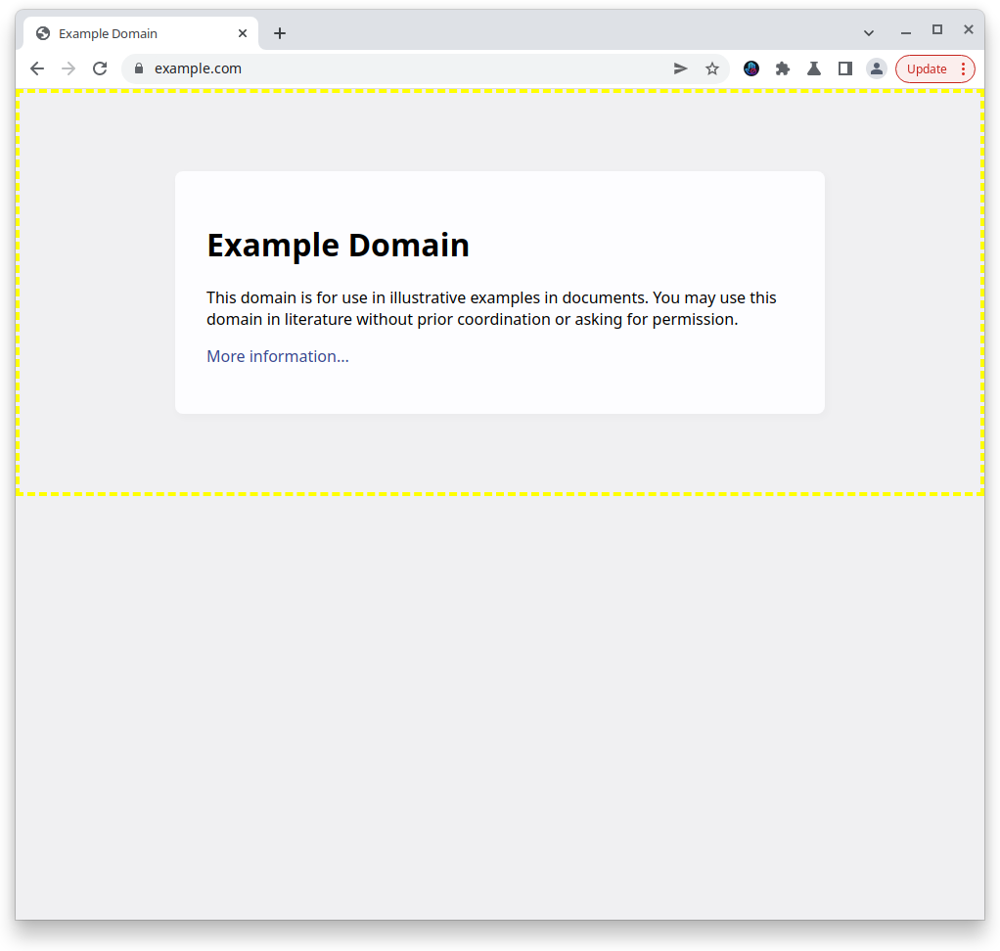

# ThreatSlayer

ThreatSlayer is a Chrome extension from Interlock that instantly 
identifies and isolates malicious sites. It does this by querying our
database of known-malicious sites. If the site is new, we use our
proprietary visual AI to identify 0-day phishing sites. Setup takes
just a minute or two and it begins protecting you instantly.

ThreatSlayer is a project of [Interlock](https://www.interlock.network/), a web3 company that is
decentralizing security. In the future, ThreatSlayer will be powered 
by $ILOCK, Interlock's token launching early 2023.

# Status

ThreatSlayer is in alpha. It occasionally shows false positives --
safe sites identified as dangerous.

# Important files

To understand what ThreatSlayer does in code, the best place to start is in
`script.js` .

# Behavior
## Detecting a malicious site
ThreatSlayer shows an alert at the top of pages identified as malicious:

To remind users that a site has been identified as malicious, 
ThreatSlayer places a red dotted border around the document body. 
After users confirm they know that the site may be malicious,
they can proceed to interact with it at their own risk. 

## Site cannot be classified
If ThreatSlayer is unsure about the status of a site, the site is
outlined with a yellow dotted border.

# Installation

1. Clone repo locally

1. Open Chrome or compatible browser (Brave, etc.)

1. Put browwser in dev-mode (if available)

1. Go to "Manage extensions"

1. Click "Load unpacked" button -- file browser will open

1. Browse to repo and select the `/source` directory

1. ThreatSlayer should be installed and active!

# Infrastructure

All of ThreatSlayer's URL scanning is performed via Interlock's DigitalOcean
droplet. A user's computer is never at risk from the scanning operation.

# Maintainer

The maintainer for ThreatSlayer is [@jmercouris](https://github.com/jmercouris).
