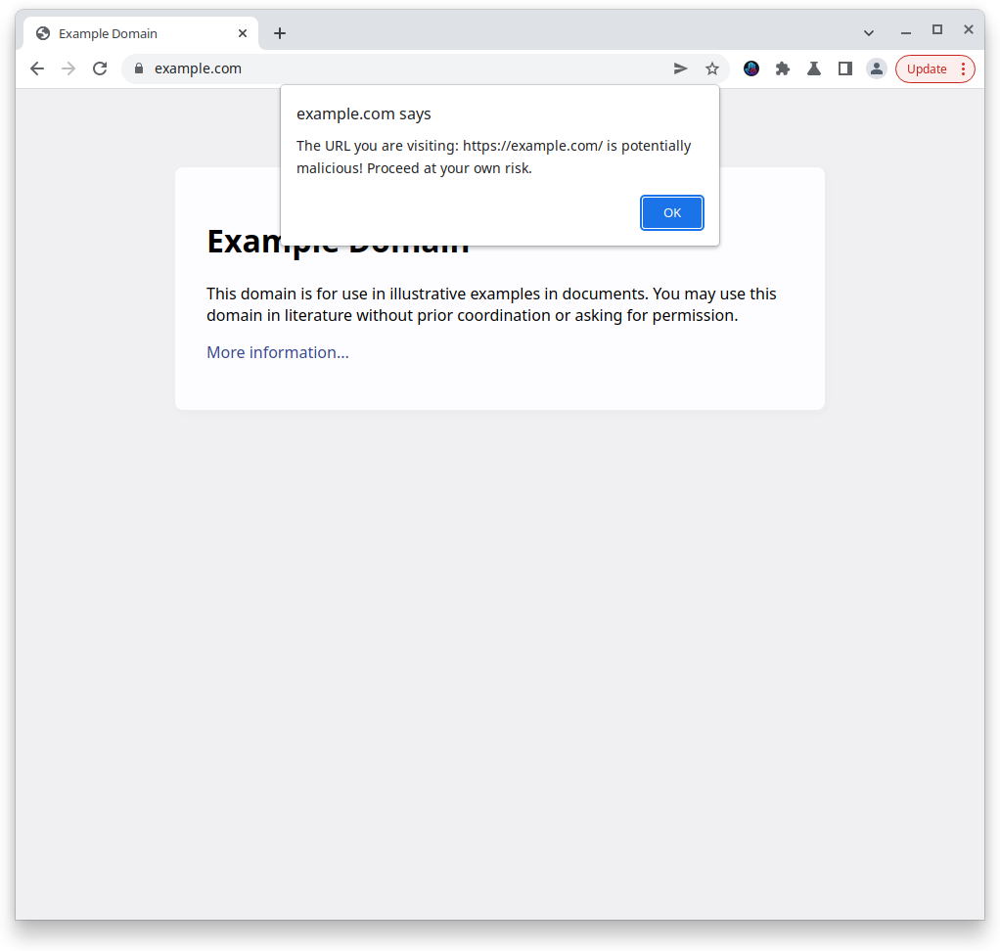

# ThreatSlayer

[ThreatSlayer is an extension for Chrome](https://chrome.google.com/webstore/detail/threatslayer/mgcmocglffknmbhhfjihifeldhghihpj) 
and compatible browsers (like Brave) that instantly protects 
you from malicious sites. Our threat-detecting AI identifies 0-day phishing sites
with no setup time required. ThreatSlayer protects you 
as soon as you install it. Firefox version coming soon!

ThreatSlayer is a project of [Interlock](https://www.interlock.network/),
a web3 company that is decentralizing security. In the future,
ThreatSlayer will be powered by $ILOCK, Interlock's token launching early 2023.

# Detect and Block Malicious Sites

ThreatSlayer instantly blocks phishing sites and prevents
you from entering any sensitive data.

# Installation

Simply get ThreatSlayer from [the extension store](https://chrome.google.com/webstore/detail/threatslayer/mgcmocglffknmbhhfjihifeldhghihpj)
and get protected instantly!

# Infrastructure

ThreatSlayer's AI runs entirely on Interlock's DigitalOcean droplet. 

# Status

ThreatSlayer is in beta. We're adding new features all the time --
check back for updates!

# Important files

To understand what ThreatSlayer does in code, the best place to start is in
`script.js` .

# Maintainer

The maintainer for ThreatSlayer is [@jmercouris](https://github.com/jmercouris).
