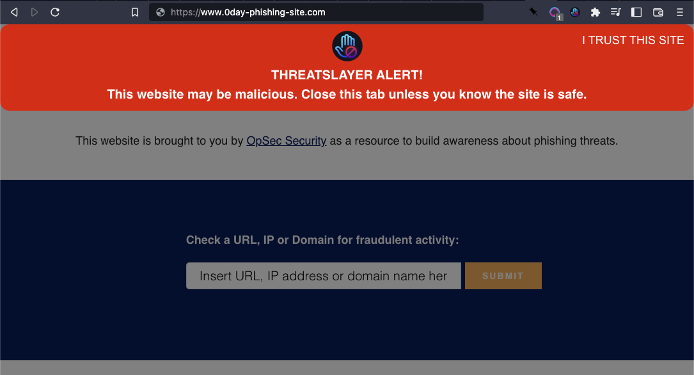

# ThreatSlayer

ThreatSlayer is an extension for Chrome and compatible browsers
(like Brave and Firefox) that instantly identifies and isolates
malicious sites. It works by checking Interlock's database
of malicious URLs. If the site is new, we use our proprietary
visual AI that identifies 0-day phishing sites. Setup takes
just a minute or two and it begins protecting you instantly.

ThreatSlayer is a project of [Interlock](https://www.interlock.network/),
a web3 company that is decentralizing security. In the future,
ThreatSlayer will be powered by $ILOCK, Interlock's token launching early 2023.

# Detect and block malicious sites

ThreatSlayer shows an alert at the top of phishing sites. It also prevents
you from entering any sensitive data until you dismiss the warning.

# Installation

1. Clone repo locally

1. Open Chrome or compatible browser (Brave, FireFox, etc.)

1. Put browser in dev-mode (if available)

1. Go to "Manage extensions"

1. Click "Load unpacked" button -- file browser will open

1. Browse to repo and select the `/source` directory

1. ThreatSlayer should be installed and active!

# Infrastructure

All of ThreatSlayer's URL scanning is performed via Interlock's DigitalOcean
droplet. A user's computer is never at risk from the scanning operation.

# Status

ThreatSlayer is in alpha. We're adding new features all the time --
check back here for updates!

# Important files

To understand what ThreatSlayer does in code, the best place to start is in
`script.js` .

# Maintainer

The maintainer for ThreatSlayer is [@jmercouris](https://github.com/jmercouris).
