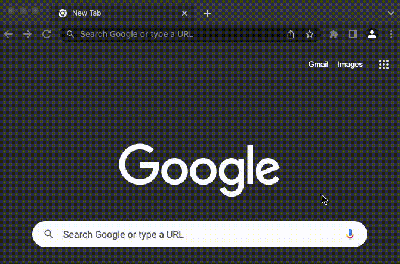
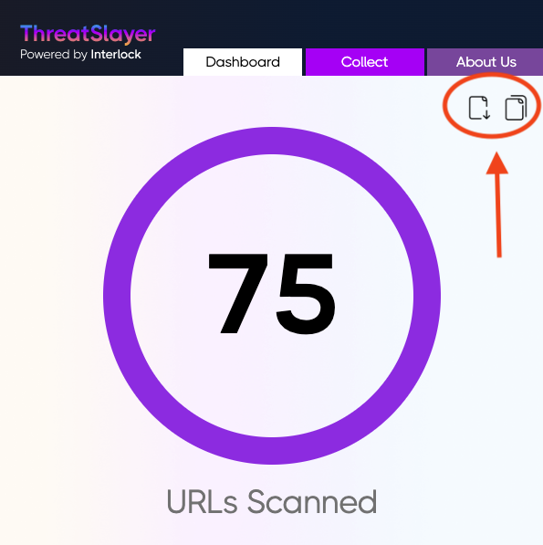
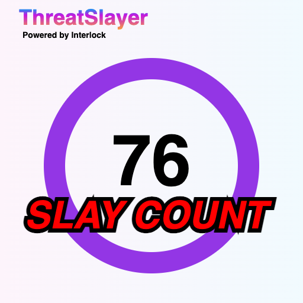

# ThreatSlayer Release Notes

### 1.0.2

* This is a reskin of ThreatSlayer
* You can now create a ThreatSlayer account!
  * Create a personal allowlist of URLs you know are safe
  * Your SlayCount is now saved to your ThreatSlayer account -- keep it forever!
* ThreatSlayer is now translated to 11 total languages:
  * Chinese (PRC), Chinese (Taiwan), English, French, Indonesian, Japanese, Malaysian, Portuguese (Brazil), Portuguese (Portugal), Spanish, Vietnamese

### 0.0.10

-   Added more translations

### 0.0.9

-   Bug fix

### 0.0.8

-   Share your Slay Count!
    -   Click the download button to get a PNG of your Slay Count,
    -   Or simply click the copy button to copy it to your buffer
    -   See pics below for details:

